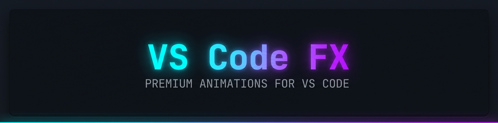
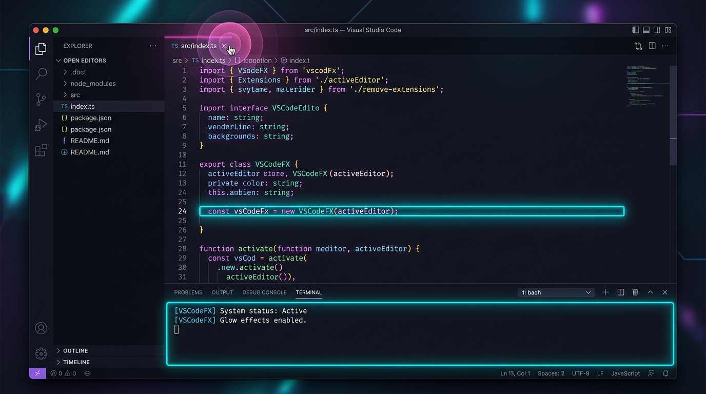
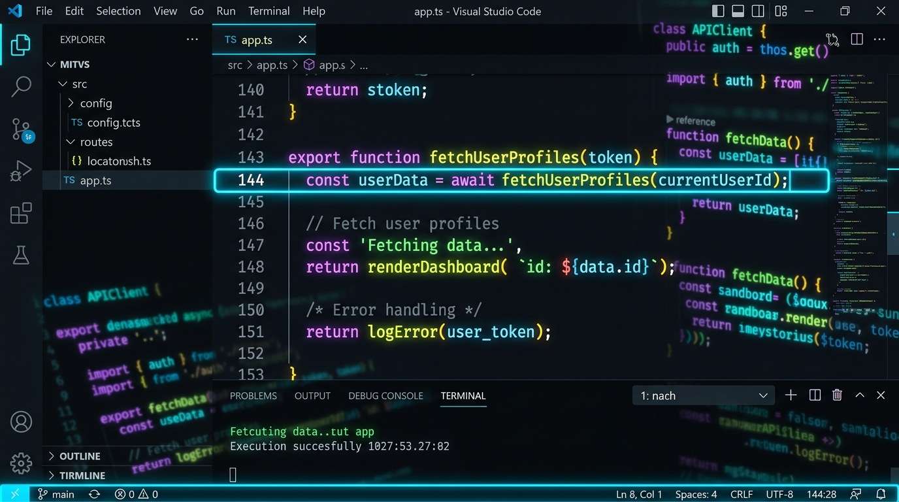
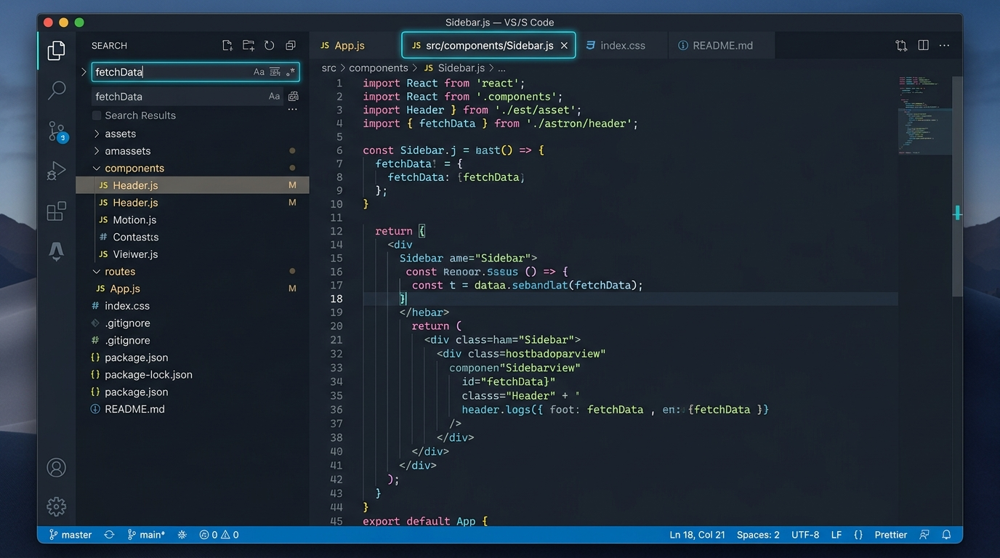

<p align="center">
  
</p>

<p align="center">
  <strong>Premium animations, neon glows, ripple effects, and smooth motion for VS Code.</strong><br />
  Theme-aware · Fully customizable · Zero configuration needed
</p>

<p align="center">
  <a href="https://marketplace.visualstudio.com/items?itemName=VSCodeFX.vscode-fx">
    
  </a>
  <a href="https://marketplace.visualstudio.com/items?itemName=VSCodeFX.vscode-fx">
    
  </a>
  <a href="https://github.com/sponsors/ZynzTehr">
    
  </a>
  <a href="https://github.com/ZynzTehr/vscode-fx/blob/main/LICENSE">
    
  </a>
</p>

---

<p align="center">
  
</p>

---

## What You Get

> **10 hand-crafted animation systems** that transform your editor from flat to cinematic, all running on pure CSS with zero performance overhead.

<table>
<tr>
<td width="50%">

### Neon Glow
Active line glow + syntax token text-shadow with adjustable intensity

### Ripple Effects
Material Design ripple on clicks across tabs, buttons, and menus

### Smooth Cursor
Smooth / trail / fade cursor movement

### Tab Animations
Slide, fade, or scale tabs on open/close

### Focus Dimming
Dim unfocused panes: Window, Column, or Full Window

</td>
<td width="50%">

### UI Polish
Hover lifts, input glow, accent highlights, scrollbar styling

### Scrolling
Slide or fade content into view as you scroll

### Command Palette
Fade, scale, or slideDown entrance animation

### Active Indent
Highlight active line with indent, scale, or fade

### Terminal FX
Glow borders, focus dimming, and ripples in the terminal

</td>
</tr>
</table>

All effects respect `prefers-reduced-motion` and high-contrast themes.

---

## Showcase

<table>
<tr>
<td width="50%" align="center">
<br />
<strong>Neon Glow</strong>: Active line and syntax token glow
</td>
<td width="50%" align="center">
<br />
<strong>UI Polish</strong>: Tab lift, input glow, accent highlights
</td>
</tr>
</table>

---

## Quick Start

```
1.  Install VS Code FX from the Extensions Marketplace
2.  Pick a CSS injection helper when prompted (recommended: Custom CSS and JS Loader)
3.  Reload VS Code
4.  Done: effects are active immediately
```

> **That's it.** Everything is enabled by default. Tweak individual effects anytime in Settings > VS Code FX.

### Required Helper Extension

VS Code FX needs a CSS injection helper to apply effects. Choose one:

| Helper | Extension ID | Notes |
|--------|-------------|-------|
| **Custom CSS and JS Loader** *(recommended)* | `be5invis.vscode-custom-css` | Stable, widely used |
| **Apc Customize UI++** | `drcika.apc-extension` | More features, occasionally breaks |

VS Code FX auto-detects which one you have installed. If neither is found, it prompts you on first launch.

---

## Settings at a Glance

All settings live under **Settings > Extensions > VS Code FX**. Here's the highlights:

### Master Controls

| Setting | Default | What it does |
|---------|---------|-------------|
| `vscodeFX.enabled` | `true` | Master kill switch |
| `vscodeFX.autoInstall` | `true` | Auto-apply when settings change |
| `vscodeFX.animationSpeed` | `normal` | Global speed: `slow` / `normal` / `fast` |

### Per-Effect Toggles

Every effect has its own `.enabled` toggle and `.style` selector:

```
vscodeFX.glow.enabled          → true/false
vscodeFX.glow.intensity        → subtle / normal / intense
vscodeFX.ripples.enabled       → true/false
vscodeFX.cursor.style           → smooth / trail / fade
vscodeFX.tabs.style             → slide / fade / scale
vscodeFX.commandPalette.style   → fade / scale / slideDown
vscodeFX.focusDimming.mode      → Window / Column / Full Window
vscodeFX.activeIndent.style     → indent / scale / fade
```

### Fine-Tuning

Custom durations for every animation (50 to 1000ms):

```
vscodeFX.durations.cursor          → 200ms
vscodeFX.durations.scrolling       → 200ms
vscodeFX.durations.tabs            → 300ms
vscodeFX.durations.commandPalette  → 300ms
vscodeFX.durations.focusDimming    → 200ms
vscodeFX.durations.uiPolish        → 140ms
```

Custom colors override theme detection:

```
vscodeFX.glow.color             → hex color or empty (auto)
vscodeFX.ripples.color          → hex color or empty (auto)
vscodeFX.uiPolish.accentColor   → hex color or empty (auto)
```

Advanced users can inject raw CSS:

```
vscodeFX.customCSS              → multiline CSS string
```

---

## Commands

| Command | What it does |
|---------|-------------|
| **VS Code FX: Enable All Effects** | Turn everything on |
| **VS Code FX: Disable All Effects** | Turn everything off |
| **VS Code FX: Install / Reload Effects** | Re-generate and inject CSS/JS |
| **VS Code FX: Change Install Method** | Switch between CSS injection helpers |

---

## How It Works

```
Settings change → CSS/JS regenerated → Helper extension injects into VS Code → Reload
```

VS Code FX generates custom CSS and JavaScript from your settings, then pipes them into VS Code's UI via the helper extension. All animations use CSS custom properties and class toggles: lightweight with no JavaScript runtime overhead in the editor.

---

## Accessibility

- All animations respect `prefers-reduced-motion: reduce`
- High contrast themes disable glow and decorative effects
- Focus indicators remain visible at all times
- No seizure-inducing patterns or rapid flashing

---

## Support the Project

VS Code FX is an independent, open-source project dedicated to providing developers with a cinematic, highly responsive visual experience inside VS Code. Every animation engine, token glow, and theme-adaptive style is engineered from scratch with zero telemetry, zero bloat, and zero runtime performance penalty.

If VS Code FX enhances your workspace, sharpens your focus, or elevates your daily setup, consider supporting ongoing development.

<p align="center">
  <a href="https://github.com/sponsors/ZynzTehr">
    
  </a>
</p>

### How your sponsorship helps
- **New Visual Systems:** Direct funding for upcoming effects, including particle bursts on keypress, audio-reactive ripples, and dedicated synthwave presets.
- **Continuous Compatibility:** Ensuring zero-latency rendering and rock-solid compatibility across every monthly VS Code release and third-party theme.
- **True Independence:** Keeping the extension completely free, open-source, and community-driven without paywalls or corporate sponsors.

Whether through a one-time tip or ongoing monthly support, every contribution directly powers active development.

---

## Contributing

Contributions welcome! [Open an issue](https://github.com/ZynzTehr/vscode-fx/issues) or [submit a PR](https://github.com/ZynzTehr/vscode-fx/pulls).

---

<p align="center">
  <strong>MIT License</strong> · Made with caffeine and CSS
</p>
